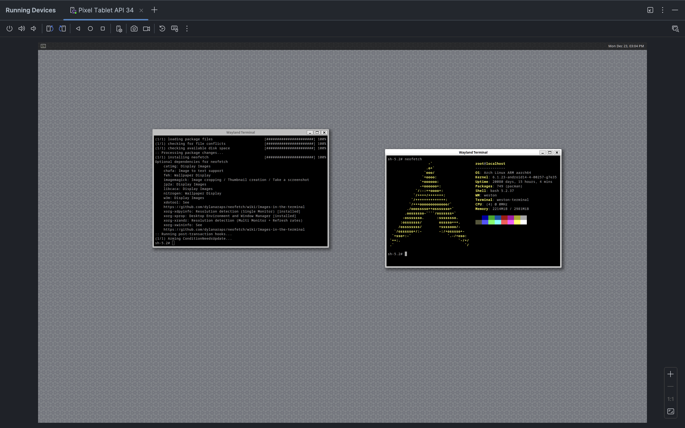

# Polar Bear

> **Discontinued**: This project is discontinued in favor of the [new Polar Bear project](https://github.com/polar-bear-app/new-polar-bear), which is a Rust rewrite aimed at making the application more stable, portable, and better suited for development directly on Android.

Polar Bear helps you run a desktop Linux environment on your Android device.

**Note**: It is expected that you already have a usable desktop experience, i.e., a large enough display (tablet or DEX), a physical keyboard, and optionally a mouse/trackpad. **Polar Bear aims to bridge the gap between the two platforms, not trying to "simulate" the desktop experience by introducing inconvenient interactions**.

## How it works

1. An Arch Linux ARM64 filesystem is set up inside the app's internal storage.
2. Proot is used to mount the filesystem and "chroot" into it.
3. A built-in Wayland backend is started inside Android via NDK.
4. Weston is started inside Linux and renders to the Wayland backend as a nested Wayland compositor.

*Proof of Concept: A Pixel Tablet running the Weston compositor inside a Proot-based ARM64 Linux environment. No configuration is required; just install and go.*

## Features

- **Standalone**: Polar Bear is **not** a set of instructions on how to setup a Linux environment using Termux. It is a standalone app that provides a streamlined Linux experience on Android.

- **Rootless**: Polar Bear does **not** require root access to run.

- **FOSS**: Polar Bear is **free and open-source**. A paid version might exists to fund development and maintenance. There is no runtime difference between the free and paid versions.

## Requirements

- Android 8.0 (Oreo) or higher (minSdk 26).
- ARM64 architecture (unless you're using an emulator, you're probably fine).

## License

Polar Bear is open-source and available under the GNU General Public License v3.0. See [LICENSE](LICENSE) for more information.
